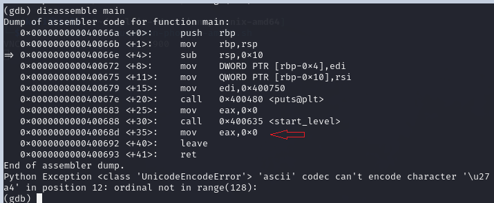
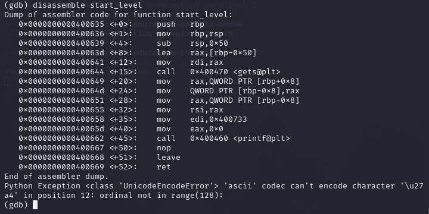

## <center>[STACK FOUR](https://exploit.education/phoenix/stack-four/)</center>
>Stack Four takes a look at what can happen when you can overwrite the saved instruction pointer (standard buffer overflow).
> ##### Hints
> + The saved instruction pointer is not necessarily directly after the end of variable allocations – things like compiler padding can increase the size. 
> [Did you know that some architectures may not save the return address on the stack in all cases?](https://en.wikipedia.org/wiki/Link_register)
> + GDB supports “run < my_file” to direct input from my_file into the program.

#### Source code
```c
/*
 * phoenix/stack-four, by https://exploit.education
 *
 * The aim is to execute the function complete_level by modifying the
 * saved return address, and pointing it to the complete_level() function.
 *
 * Why were the apple and orange all alone? Because the bananna split.
 */

#include <err.h>
#include <stdio.h>
#include <stdlib.h>
#include <string.h>
#include <unistd.h>

#define BANNER \
  "Welcome to " LEVELNAME ", brought to you by https://exploit.education"

char *gets(char *);

void complete_level() {
  printf("Congratulations, you've finished " LEVELNAME " :-) Well done!\n");
  exit(0);
}

void start_level() {
  char buffer[64];
  void *ret;

  gets(buffer);

  ret = __builtin_return_address(0);
  printf("and will be returning to %p\n", ret);
}

int main(int argc, char **argv) {
  printf("%s\n", BANNER);
  start_level();
}
```
### Solution:
```
user@phoenix-amd64:/opt/phoenix/amd64$ checksec stack-four
[*] '/opt/phoenix/amd64/stack-four'
    Arch:     amd64-64-little
    RELRO:    No RELRO
    Stack:    No canary found
    NX:       NX disabled
    PIE:      No PIE (0x400000)
    RWX:      Has RWX segments
    RPATH:    '/opt/phoenix/x86_64-linux-musl/lib'
```
- Tương tự các level trước ta kiểm tra các biện pháp bảo mật của file thực thi đều bị tắt
- Nhìn vào source code ta thấy hàm `gets` cho phép nhận đầu vào không giới hạn tương tự các level trước, điều này sẽ dẫn đến lỗi tràn bộ đệm và sẽ ghi dữ liệu vào các bộ đệm lân cận
- Mục tiêu của ta là sẽ ghi đè địa chỉ của hàm `complete_level` vào địa chỉ chứa lệnh sau khi hàm `start_level` kết thúc
- Khác với `stack-three`, ta phải tìm offset giữa địa chỉ của `buffer` và địa chỉ chứa địa chỉ của lệnh sau khi hàm `start_level` kết thúc, sau khi tìm được offset thì ta chỉ cần nhập đủ số kí tự đó + địa chỉ của hàm `complete_level`  
- Ta gdb tìm địa chỉ hàm `complete_level`
```
(gdb) p complete_level
$1 = {<text variable, no debug info>} 0x40061d <complete_level>
Python Exception <class 'UnicodeEncodeError'> 'ascii' codec can't encode character '\u27a4' in position 12: ordinal not in range(128):
```
- Địa chỉ hàm `complete_level` là `0x40061d`
- Ta `disassemble` hàm `main`

- Ta thấy địa chỉ chứa lệnh tiếp theo sau khi kết thúc hàm `start_level` là `0x000000000040068d`
- Tiếp tục xem hàm `start_level`

- Ta đặt breakpoint tại địa chỉ sau khi hàm `gets` kết thúc là `0x0000000000400649` sau đó chạy chương trình và nhập 64 kí tự `a` xem stack có gì

- Ta thấy địa chỉ bắt đầu của `buffer` trên stack là `0x7fffffffe5d0`
- Nhìn vào đó ta cũng có thể thấy địa chỉ chứa lệnh sau khi hàm `start_level` kết thúc nằm ở địa chỉ `0x7fffffffe628` trên stack

- Tính offset `0x7fffffffe628 - 0x7fffffffe5d0 = 0x58 = 88`
  